# Taskflow — UML Design Documentation

**Project:** Taskflow SaaS Task Manager  
**Stack:** React + Vite, Express 5, PostgreSQL, Drizzle ORM, Clerk Auth  
**Date:** May 2026

---

## 1. Use Case Diagram

Describes the interactions between actors (users and the system) and the features of Taskflow.

```mermaid
%%{init: {"theme": "default"}}%%
graph TD
    User(["👤 User"])
    Clerk(["🔐 Clerk Auth Service"])
    DB(["🗄️ PostgreSQL"])

    subgraph Taskflow System
        UC1([Sign Up])
        UC2([Sign In])
        UC3([Sign Out])
        UC4([View Dashboard])
        UC5([View Summary Stats])
        UC6([View Activity Feed])
        UC7([Create Project])
        UC8([Edit Project])
        UC9([Delete Project])
        UC10([View Project Details])
        UC11([Create Task])
        UC12([Edit Task])
        UC13([Delete Task])
        UC14([Update Task Status])
        UC15([Filter Tasks])
        UC16([View All Tasks])
        UC17([View Profile])
    end

    User --> UC1
    User --> UC2
    User --> UC3
    User --> UC4
    User --> UC7
    User --> UC8
    User --> UC9
    User --> UC10
    User --> UC11
    User --> UC12
    User --> UC13
    User --> UC14
    User --> UC15
    User --> UC16
    User --> UC17

    UC4 --> UC5
    UC4 --> UC6

    UC1 --> Clerk
    UC2 --> Clerk
    UC3 --> Clerk

    UC7 --> DB
    UC8 --> DB
    UC9 --> DB
    UC10 --> DB
    UC11 --> DB
    UC12 --> DB
    UC13 --> DB
    UC14 --> DB
    UC15 --> DB
    UC16 --> DB
    UC4 --> DB
```

### Actors

| Actor | Description |
|-------|-------------|
| **User** | Authenticated person managing projects and tasks |
| **Clerk Auth Service** | External identity provider handling sign-up, sign-in, and session management |
| **PostgreSQL** | Database storing all persistent application data |

### Use Cases Summary

| ID | Use Case | Actor | Description |
|----|----------|-------|-------------|
| UC1 | Sign Up | User, Clerk | Register a new account |
| UC2 | Sign In | User, Clerk | Log in with existing credentials |
| UC3 | Sign Out | User, Clerk | End current session |
| UC4 | View Dashboard | User, DB | See summary stats and recent activity |
| UC5 | View Summary Stats | User, DB | Counts for tasks by status, priority, completion rate |
| UC6 | View Activity Feed | User, DB | Timeline of recent task actions |
| UC7 | Create Project | User, DB | Add a new project with name, description, color |
| UC8 | Edit Project | User, DB | Modify project name, description, or color |
| UC9 | Delete Project | User, DB | Remove a project |
| UC10 | View Project Details | User, DB | See all tasks belonging to a project |
| UC11 | Create Task | User, DB | Add a task with title, priority, status, due date |
| UC12 | Edit Task | User, DB | Modify task fields |
| UC13 | Delete Task | User, DB | Remove a task |
| UC14 | Update Task Status | User, DB | Toggle todo → in_progress → done |
| UC15 | Filter Tasks | User, DB | Filter by status, priority, or project |
| UC16 | View All Tasks | User, DB | See all tasks across projects |
| UC17 | View Profile | User, Clerk | View account name, email, avatar |

---

## 2. Activity Diagram

Shows the flow of key user activities within the application.

### 2a. User Authentication Flow

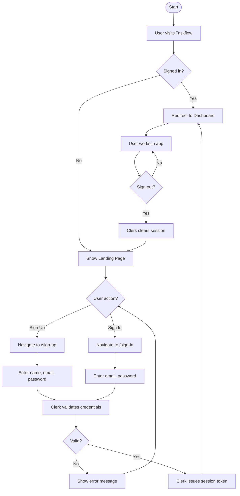

### 2b. Task Management Flow

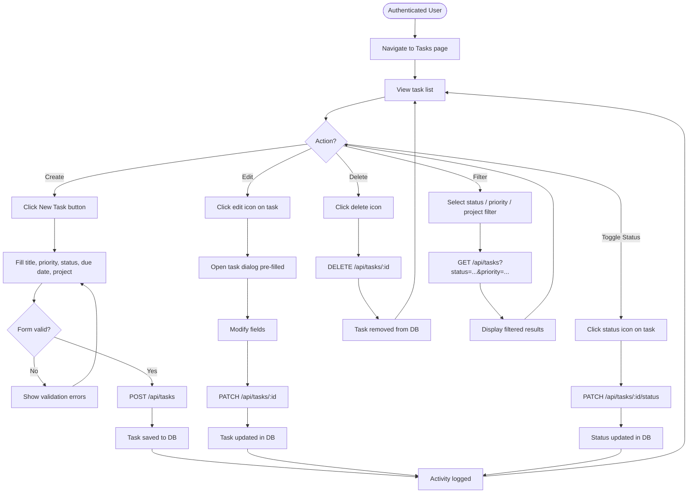

### 2c. Project Creation Flow

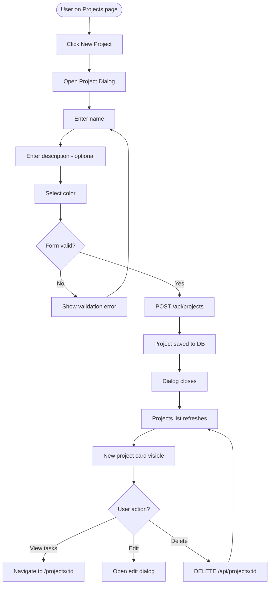

---

## 3. Component Diagram

Shows the architecture of the system and how components interact.

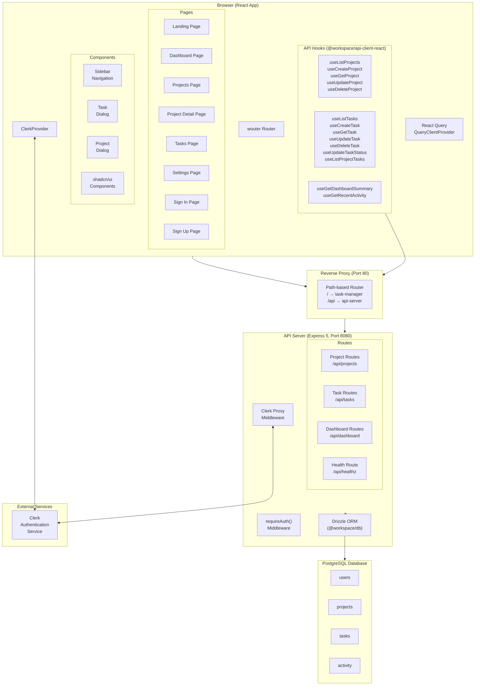

---

## 4. Sequence Diagram

Shows the step-by-step message flow for key operations.

### 4a. User Sign-In Flow

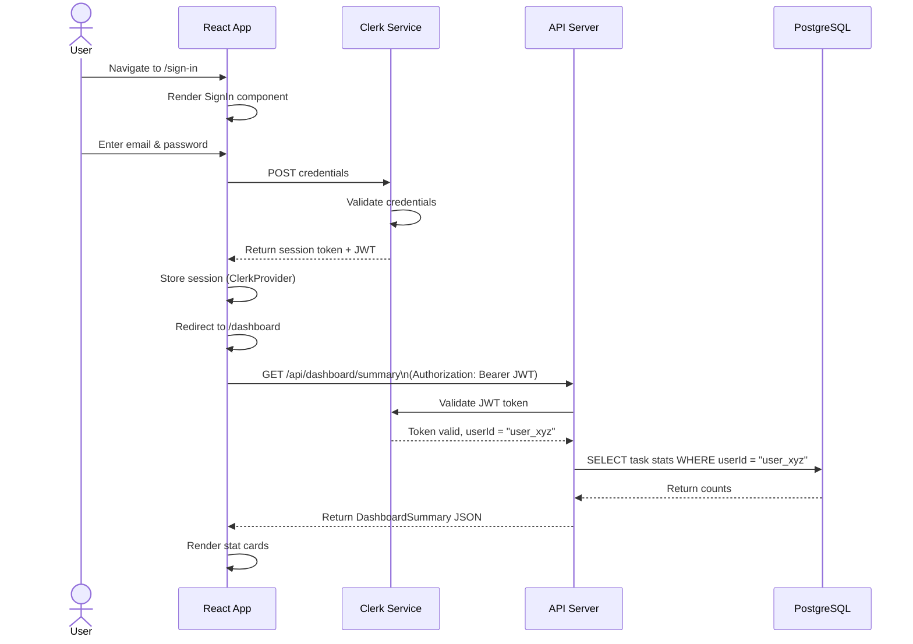

### 4b. Create Task Flow

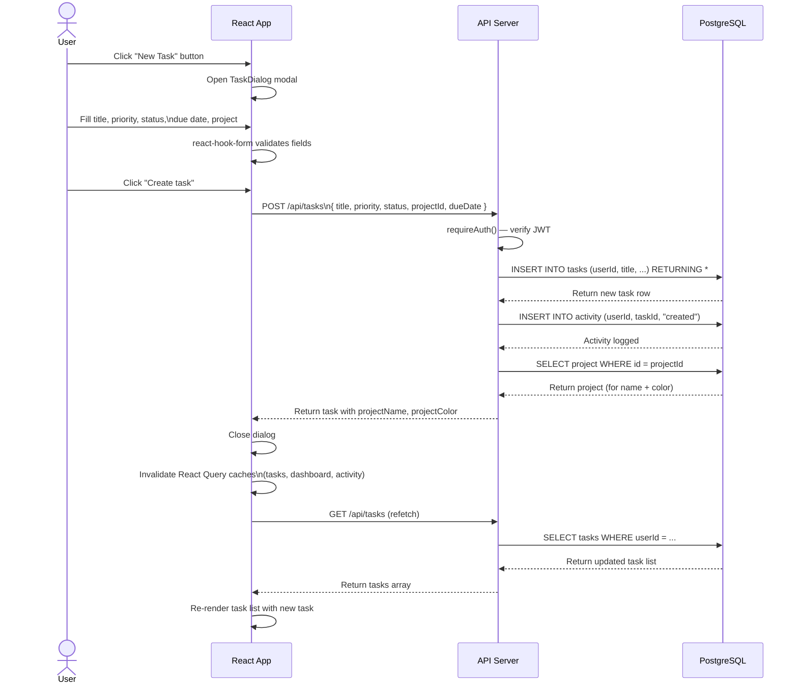

### 4c. Update Task Status Flow

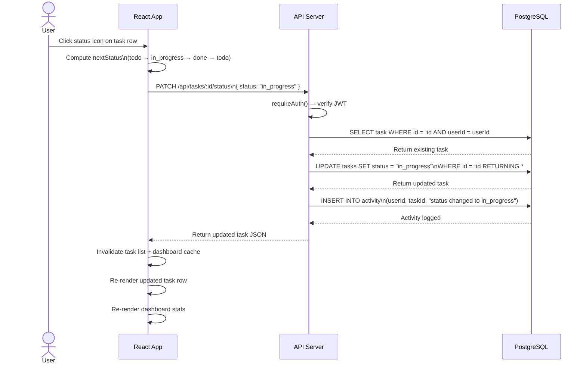

### 4d. Delete Project Flow

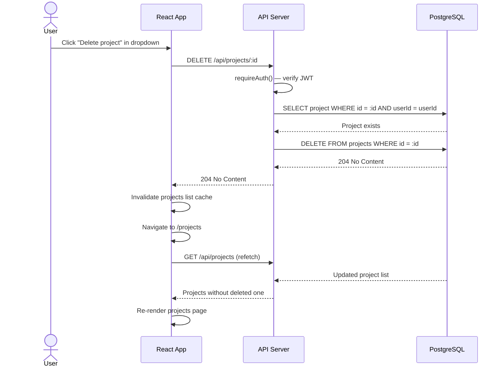

---

## 5. Class Diagram

Shows the data models, their attributes, types, and relationships.

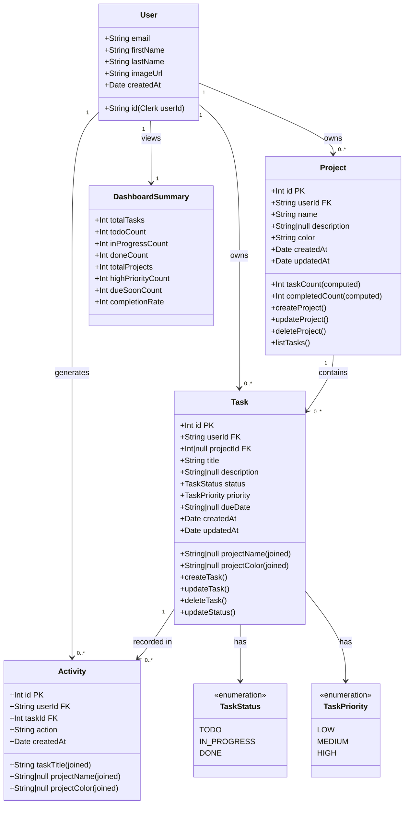

### Data Model Details

#### Task Status Transitions

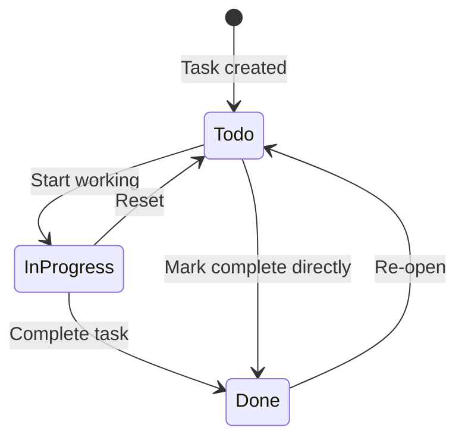

#### Entity Relationships

| Relationship | Type | Description |
|---|---|---|
| User → Project | One-to-Many | A user owns multiple projects |
| User → Task | One-to-Many | A user owns multiple tasks |
| Project → Task | One-to-Many | A project contains multiple tasks |
| Task → Activity | One-to-Many | Each task action creates an activity log entry |
| User → Activity | One-to-Many | All activity is scoped to a user |

---

## System Overview

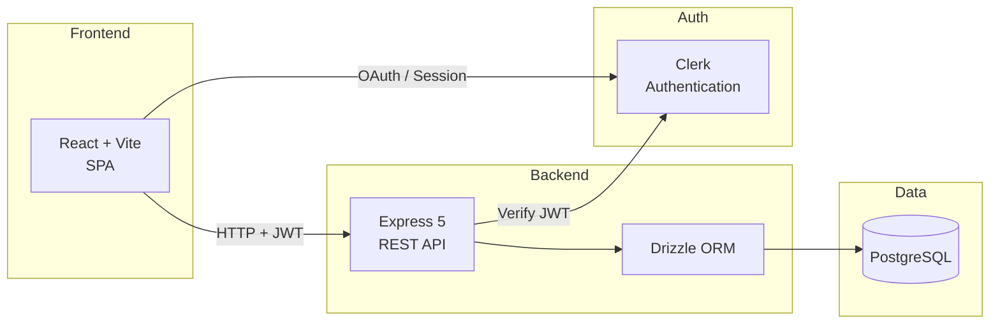

| Layer | Technology | Purpose |
|-------|-----------|---------|
| Frontend | React 19, Vite 7, Tailwind CSS v4 | UI rendering and user interaction |
| Routing | wouter | Client-side SPA routing |
| State / Data Fetching | React Query (TanStack) | Server state, caching, background refetch |
| Form Handling | react-hook-form + Zod | Validated form inputs |
| Authentication | Clerk | User identity, sessions, OAuth |
| API | Express 5, TypeScript | REST endpoints, business logic |
| ORM | Drizzle ORM | Type-safe SQL query builder |
| Database | PostgreSQL | Persistent relational data storage |
| API Contract | OpenAPI 3.0 + Orval | Code-generated hooks and Zod schemas |
